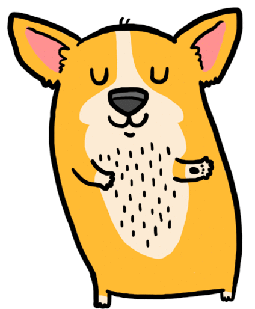
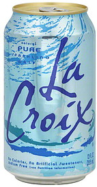
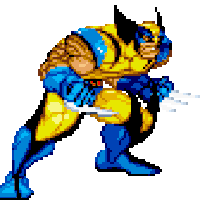

# HipChat emoticons

The core set of [emoticons included with HipChat](https://www.hipchat.com/emoticons) is great, but there is always room for improvement.
Thankfully, hipchat let's you upload custom emoticons to personalize your emoticon experience, and supports animated gifs.  Custom HipChat emoticons are ideally square with dimensions of 120+ pixels.  Larger, more detailed emoticon source images will look better when viewed on high pixel density (retina) devices.

## Emoticons

 (ambulance)
 (breakdance)
 (carlton)
 (dancingcorgi)

 (drunk)
 (foos)
 (gross)
 (lacroix)

 (leftshark)
 (magnum)
 (mindblownxl)
 (mugatu)

 (nerddance)
 (nerfwar)
 (penguin)
 (run)

 (thehorror)
 (tumbleweed)
 (walk)
 (wolverine)

## Emoticon DIY Guide

For creating your own emoticons from animated gifs found in the wild, try the [EZgif animated GIF resizer](http://ezgif.com/resize) - it lets you crop, resize, and change the speed of animated gifs to make them more ideal for use as HipChat emoticons.  Other good HipChat emoticon resources are: [emoticonHQ](http://emoticonhq.com/skypeemoticons.html), [ModCloth](https://github.com/modcloth/hipchat-emoticons), and [FourKitchens](https://github.com/fourkitchens/hipchat-emoticons).
